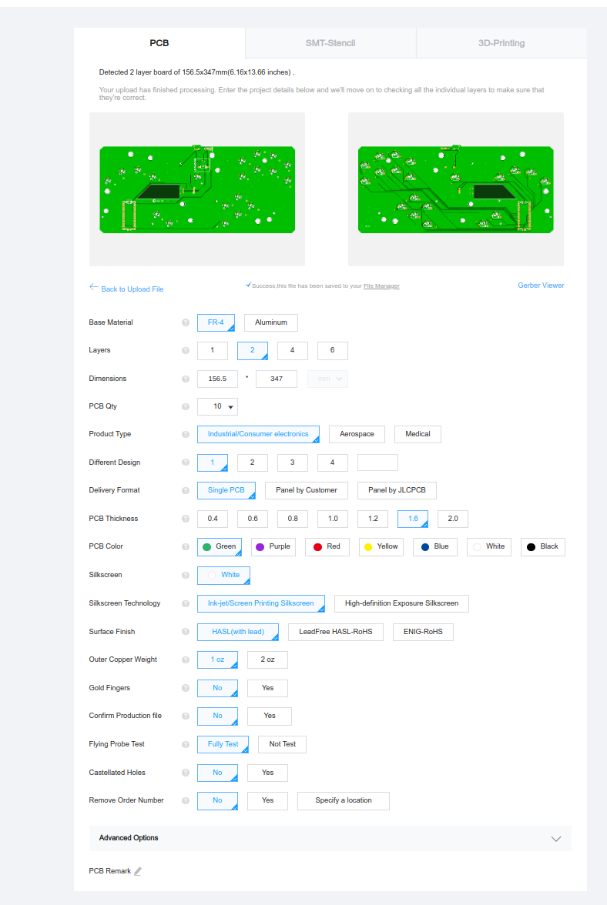
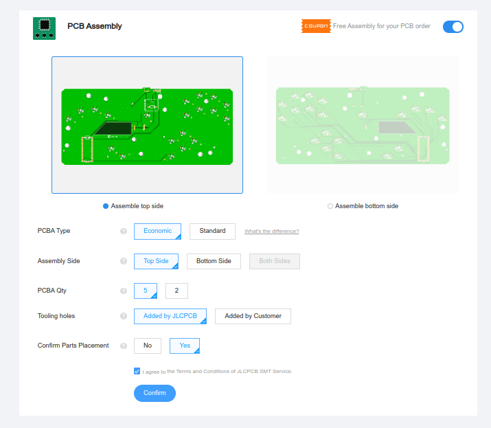
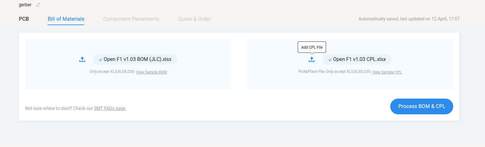
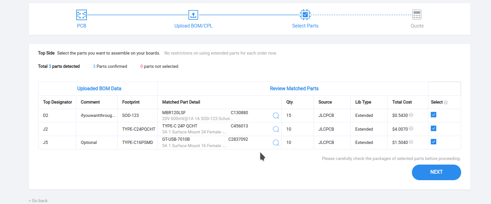
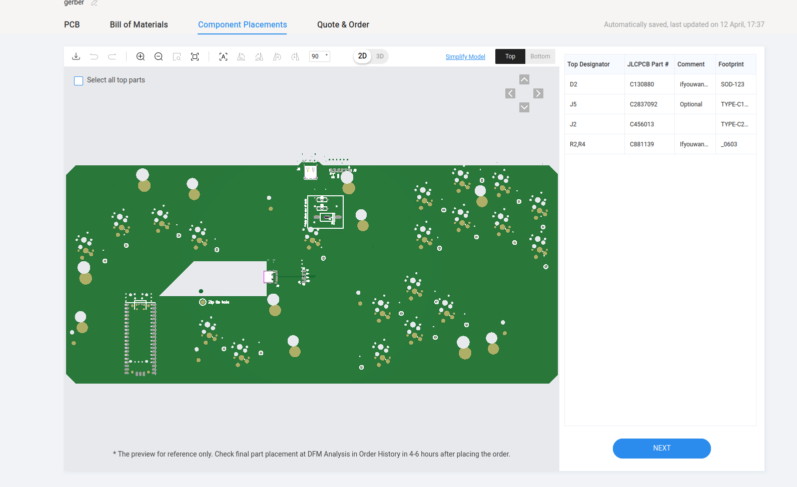
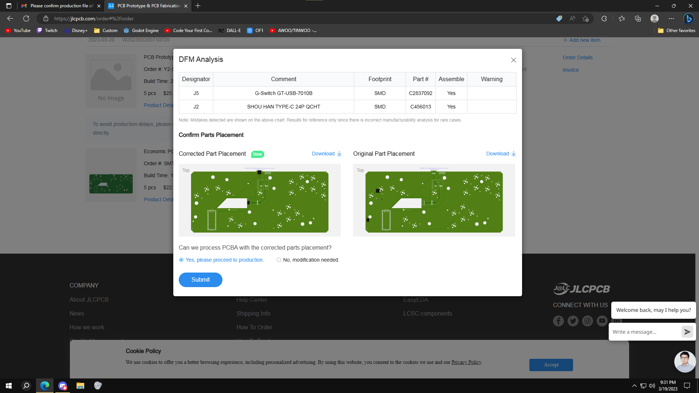

# Open-Frame1 Ordering Guide
First screen you'll upload the fabrication files. Just upload .zip file located /PCB/Board Fab Files/. At the bottom of this screen JLC asks if you want them to do any smt assembly.

Next screen they ask for the BOM (Bill of Materials) spreadsheet and the CPL (tells them where to place the components) spreadsheet. Upload the 2 .xlsx files located in the same folder as the .zip.

The next screen will ask which components you want them to assemble. The 24 pin connector is pretty much mandatory as you can't do it without a hot air station. The other 2 components are convenient.

The next screen shows you a preview and from there you should be good to order. Initial renders of the part placement will likely be incorrect. THIS IS OK! If you selected yes to "confirm parts placement" on screen 1 jlc will reach out via email and fix the placements. You will need to confirm that the parts are correct similar to the image included.

